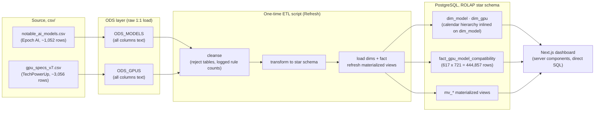

# WeightBox

**GPU and Model Compatibility Observatory**, a local ROLAP data warehouse that
answers one question:

> *Given a specific GPU, which AI models can it realistically run, at what
> inference speed, and under what conditions?*

Data Management 2025/2026 course project. For every `(GPU, model)` pair the
warehouse materialises whether the model's weights **fit in VRAM**, the **headroom**
left, whether **quantization** (8-bit / 4-bit) is needed to make it fit, and, for
generative models, an **estimated inference throughput** derived from the card's
memory bandwidth.

Design and rationale live in [`WEIGHTBOX_SPECS.md`](./docs/WEIGHTBOX_SPECS.md).
System shape and the ETL phases are in [`docs/ARCHITECTURE.md`](./docs/ARCHITECTURE.md).
The physical schema is in [`docs/DATA_SCHEMA.md`](./docs/DATA_SCHEMA.md). This
README is the operational overview.

## Architecture



- **ODS layer** (Operational Data Store): each CSV is loaded *verbatim* into a
  single all-text table, `ODS_MODELS`, `ODS_GPUS`, before any processing. Every
  later phase reads only from these tables, never the files.
- **ROLAP star schema** in PostgreSQL: one fact
  (`fact_gpu_model_compatibility`, grain = one `(GPU, model)` pair) and **two
  dimensions** (`dim_model`, `dim_gpu`). There is no `dim_time`, the model's
  publication date is the only date in the data, so its `day → month → quarter →
  year → decade` hierarchy is inlined on `dim_model` (see
  `docs/WEIGHTBOX_SPECS.md` §2.5).
- **ETL**, a single one-time Python script (pandas + SQLAlchemy) following the
  course's four phases: Extraction (raw CSV → ODS), then Cleansing, Transformation
  and Loading (all off the ODS tables). Cleansing is substantial: the GPU source
  has a BOM header, ~77 % missing memory-bus widths in the modern subset, dirty
  `memType` spellings, duplicate product names, and deliberately impossible
  chip/memory combinations. On the model side, a third of the source rows carry
  no `Parameters` value; the ETL tries to recover a size from the model name
  itself (`"...-70B-Instruct"` → 70e9) and drops the row when it can't.
- **Frontend** (out of scope of the spec): a Next.js + Recharts dashboard whose
  server components query the PostgreSQL star schema and materialized views
  **directly**, there is no separate API service, presenting the three OLAP
  analyses to non-technical stakeholders.

## Repository layout

| Path | Contents |
|---|---|
| `docs/WEIGHTBOX_SPECS.md` | Data-warehouse design specification (start here) |
| `docs/ARCHITECTURE.md` | System shape, the four ETL phases, module layout |
| `docs/DATA_SCHEMA.md` | Physical schema: every table, column, index, view |
| `database/schema.sql` | Generated reference of the schema the ETL builds |
| `etl/` | The ETL program (see below) and its Dockerfile |
| `frontend/` | Next.js dashboard, queries PostgreSQL directly |
| `csv/` | Source datasets |
| `docs/` | Design docs above, plus the project proposal |

Inside `etl/`:

| Path | Contents |
|---|---|
| `src/` | Pipeline orchestration, cleansing, transforms, lookups, one module per phase |
| `services/` | `config.py` (settings from env), `postgres.py` (connector), `schema_validator.py` |
| `SQL/tables/` | DDL, each table paired with a `TableSpec` |
| `SQL/queries/` | Runtime statements (ODS load, fact build, validation, health, refresh) |
| `data/models.py` | Pydantic contracts passed between phases |
| `tests/` | `unit/` (no database), `integration/` (throwaway Postgres) |

## Datasets

| File | Rows | Source | Licence |
|---|---:|---|---|
| `csv/notable_ai_models.csv` | ~1,052 | Epoch AI, *Notable AI Models* (`epoch.ai/data`) | CC-BY |
| `csv/gpu_specs_v7.csv` | ~3,056 | Kaggle `alanjo/graphics-card-full-specs` (TechPowerUp-derived) | see Kaggle |

Only these two files are used. `all_ai_models.csv`, `large_scale_ai_models.csv` and
`frontier_ai_models.csv` are other exports of the same Epoch data and are not part
of the pipeline.

> **Caveat:** the repo copies contain partly **synthetic / future-dated** rows
> (models dated into 2026, an `RTX 5090` entry) and **deliberately injected quality
> defects**. This is intentional, cleansing them is part of the exercise. Phase 2
> logs a count for every rule it applied.

## Quick start

Requires Docker + Docker Compose.

```bash
cp .env.example .env
# edit .env: set POSTGRES_PASSWORD and the matching DATABASE_URL / PG_DSN

docker compose up -d db                          # start PostgreSQL
docker compose --profile etl run --rm etl        # run the ETL (all four phases)
docker compose run --rm etl pytest -q            # run the test suite

cd frontend && npm install && npm run dev        # start the dashboard
# the frontend needs its own DATABASE_URL pointing at localhost:5432
```

| Service | URL |
|---|---|
| PostgreSQL | `localhost:5432` (db `weightbox`) |
| Next.js dashboard | <http://localhost:3000> |

Inspect the result:

```bash
docker compose exec db psql -U "$POSTGRES_USER" -d "$POSTGRES_DB" \
  -c "SELECT count(*) FROM fact_gpu_model_compatibility;" \
  -c "TABLE validator_fact_nulls;"
```

Re-running the ETL is safe. The ODS upload is skipped when the source file is
unchanged, and the star schema is rebuilt from the ODS each time (Refresh).

## Status

The ETL is implemented and tested against the real datasets: 1,052 model records
and 3,056 GPU records load into the ODS, cleansing keeps 721 models (331 dropped
for a blank `Parameters` cell with no recoverable size in the model name) and
617 GPUs, and the fact table holds their cross product (444,857 rows).
`docker-compose.yml` defines `db` and `etl` only; there is no API tier. The
frontend is still the default Next.js scaffold.

## Team

Marco De Luca (2283822) · Chrision Wynaar (2237431)
Data Management 2025/2026, Data Warehousing, ROLAP (PostgreSQL)
