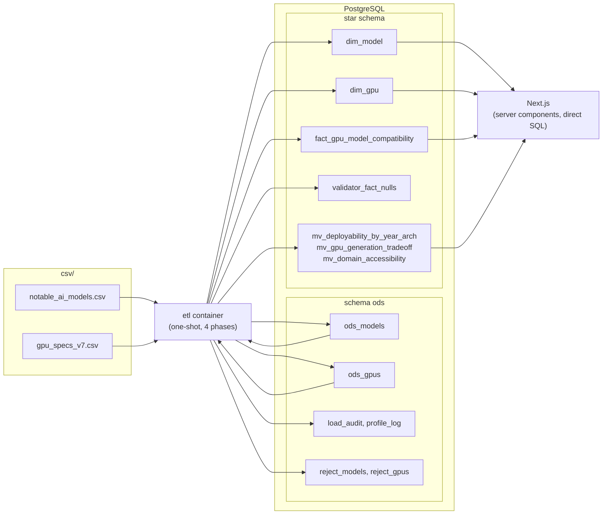

# WeightBox architecture

WeightBox is a local ROLAP data warehouse. Two source CSVs are loaded verbatim
into an ODS layer, a batch ETL turns that into a star schema in PostgreSQL, and a
Next.js app reads the star schema and its materialized views directly over a
database connection. There is no API tier.

For the design rationale (why a star schema, why no `dim_time`, how the derived
measures are defined) see [`WEIGHTBOX_SPECS.md`](./WEIGHTBOX_SPECS.md). For the
physical column-by-column schema see [`DATA_SCHEMA.md`](./DATA_SCHEMA.md).

## Components



## The ETL program

One process, `python -m src.main`, packaged as the `etl` service in
`docker-compose.yml`. It runs four phases in order and exits non-zero if any
phase fails (`ETL_FAIL_FAST`). `--only <phase>` runs one phase; `--from <phase>`
runs from that phase to the end.

### Phase 1: initialization

Creates the `ods` schema and every table and materialized view with
`CREATE ... IF NOT EXISTS`, then checks the live schema against the `TableSpec`
that defined it (missing table, missing column, wrong base type, wrong
nullability all abort here). Then it loads each CSV into its ODS table. The load
is idempotent: a file whose sha256 already appears in `ods.load_audit` is skipped
while `ETL_SKIP_ODS_IF_LOADED` is set, otherwise the ODS table is truncated and
reloaded with a real CSV parser (embedded newlines in the source rule out line
reads). Per-column empty rates go to `ods.profile_log`.

### Phase 2: ETL operations

Reads only the ODS tables. Cleansing applies the GPU rules G1 to G8 and the model
rules M1 to M6 from the spec; rejected rows go to `ods.reject_gpus` /
`ods.reject_models` with a rule and a detail. Transformation derives the calendar
parts, the buckets, the canonical memory type and its family and data rate, the
memory bandwidth, the architecture, the primary domain and the generative flag.
The load is Refresh: truncate the star tables, bulk-load the two dimensions, seed
`validator_fact_nulls` with one row per nullable fact attribute, build the fact
with one set-based `INSERT ... SELECT` over `dim_gpu CROSS JOIN dim_model`, then
grade `validator_fact_nulls` and assert the post-load invariants (row count
equals the cross product, no orphan foreign keys, `does-not-fit` implies not
fitting, natural keys populated). Finally it refreshes the three materialized
views, runs `ANALYZE`, and logs a run summary: per-rule counts, reject-table
sizes, dimension and fact row counts, validator status. No file is written.

### Phase 3: indexing

Creates the indexes, including the two required on the fact table:
`ix_fact_model_nk` on `model_nk` and `ix_fact_gpu_nk` on `gpu_nk`. It verifies
both exist before returning.

### Phase 4: health check

Reads the server version, database size, connection count, per-table row counts,
index presence, materialized-view row counts, and whether every
`validator_fact_nulls` row passed. It returns healthy only if the dimensions and
the fact are non-empty, both fact-name indexes exist, and the validator is clean.

## Module layout

```
etl/
  src/          pipeline orchestration, cleansing, transforms, lookups
    main.py       entry point and argument parsing
    pipeline.py   runs the four phases, owns the connector
    phase_*.py    one module per phase
    cleansing.py  G1..G8 and M1..M6 over DataFrames
    transform.py  scalar derivations (also unit-tested directly)
    lookups.py    static reference data (Appendix B and C)
  services/     infrastructure
    config.py           Settings, read from the environment
    postgres.py         PostgresConnector: psycopg for SQL and COPY, SQLAlchemy for the pandas bridge
    schema_validator.py schema check plus the validator_fact_nulls audit
  SQL/          all SQL, as Python
    tables/       DDL, each table paired with its TableSpec
    queries/      runtime statements (ODS load, fact build, validation, health, refresh)
  data/
    models.py     Pydantic contracts passed between phases
  tests/        unit (no database) and integration (throwaway Postgres)
```

The connector is created once by the pipeline and passed to every phase, so no
other module opens a connection. A table is defined in exactly one place, a
`TableSpec` in `SQL/tables/`, which both renders the `CREATE TABLE` and drives the
schema check. Results move between phases as Pydantic models (`PhaseReport`,
`OdsLoadResult`, `FactNullResult`, `HealthReport`).

## Deployment

See the [README](../README.md#quick-start) for setup, configuration and commands.

```bash
cp -n .env.example .env
# Set POSTGRES_PASSWORD; preserve an existing .env.
sh scripts/start.sh
docker compose --profile test run --build --rm tests
```

Compose defines `db` (PostgreSQL 16 with persistent storage), `etl` (one-shot
Python 3.12 job, profile `etl`, CSVs mounted read-only), and `frontend`
(Node 22 / Next.js standalone server). `test-db` and `tests` belong to the
optional `test` profile and use disposable database storage.

The startup script waits for the database, runs ETL, then starts the frontend.
Compose itself requires database health but does not automatically run the ETL
profile. An unpopulated database makes frontend readiness return 503.
The server-only PostgreSQL pool reads the same connection parts as the ETL.
Browser requests stay on the Next.js origin; there is no separate API tier.
The `/` workbench renders GPU selection, model compatibility, and three analyses
through server components and parameterized SQL. `/data` reads source-load and
validation metadata; `/methodology` explains the formulas. Client components
manage URL navigation and charts without receiving connection credentials.
`/api/health` remains the operational readiness endpoint.

The timeline and domain analyses read materialized views. The VRAM trade-off
queries the star schema directly because the generation view groups by model
parameter bucket rather than GPU VRAM. Rates exclude unknown parameter counts;
the interface distinguishes pair counts from distinct-model counts.

Both application containers use non-root runtime users. Docker build contexts
exclude secrets, host dependencies and generated output. The development
override mounts only frontend source and public assets, leaving Linux
dependencies and Next.js build output inside the container.
