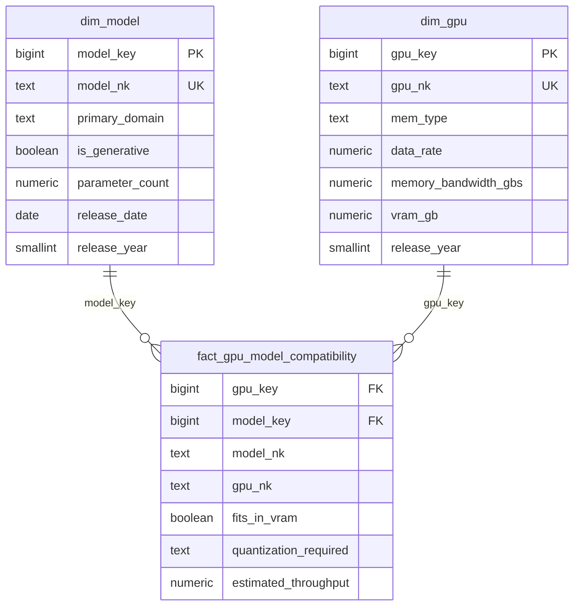

# WeightBox data schema

The physical schema the ETL builds. This is the as-built reference;
[`WEIGHTBOX_SPECS.md`](./WEIGHTBOX_SPECS.md) holds the design reasoning and
Appendix A has the source-column to warehouse-column mapping. The single source
of truth is `etl/SQL/tables/*.py`; `database/schema.sql` is generated from it.

Three groups of relations:

- `ods.*` holds the two source CSVs verbatim, plus load and reject bookkeeping.
- The star schema (`dim_model`, `dim_gpu`, `fact_gpu_model_compatibility`) holds
  the analysable data. There is no `dim_time`; the calendar hierarchy is inlined
  on `dim_model`.
- `validator_fact_nulls` records whether each nullable fact column obeys its NULL
  rule, and the three `mv_*` materialized views pre-aggregate the OLAP analyses.

## ODS layer (`schema ods`)

### ods.ods_models

One row per record in `csv/notable_ai_models.csv`. Every source column is stored
as `text`; `ods_model_id` is a surrogate, `_source_sha256` and `_loaded_at`
record the load. Column names are the CSV headers slugified (`"Training compute
(FLOP)"` becomes `training_compute_flop`, camelCase is split):

`model, organization, publication_date, domain, task, parameters,
parameters_notes, training_compute_flop, training_compute_notes,
training_dataset, training_dataset_size_total, dataset_size_notes, confidence,
link, reference, citations, authors, abstract, organization_categorization,
country_of_organization, notability_criteria, notability_criteria_notes, epochs,
training_time_hours, training_time_notes, training_hardware, hardware_quantity,
hardware_utilization_mfu, training_compute_cost_2023_usd, compute_cost_notes,
training_power_draw_w, base_model, finetune_compute_flop, finetune_compute_notes,
batch_size, batch_size_notes, model_accessibility, training_code_accessibility,
inference_code_accessibility, accessibility_notes, numerical_format,
frontier_model, hardware_acquisition_cost, hardware_utilization_hfu,
training_compute_cost_cloud, training_compute_cost_upfront, open_model_weights`

### ods.ods_gpus

One row per record in `csv/gpu_specs_v7.csv`, same conventions:

`manufacturer, product_name, release_year, mem_size, mem_bus_width, gpu_clock,
mem_clock, unified_shader, tmu, rop, pixel_shader, vertex_shader, igp, bus,
mem_type, gpu_chip`

### ods.load_audit

| column | type | null |
|---|---|---|
| load_id | bigint identity | no |
| ods_table | text | no |
| file_name | text | no |
| sha256 | text | no |
| row_count | integer | no |
| loaded_at | timestamptz default now() | no |

### ods.profile_log

| column | type | null |
|---|---|---|
| profile_id | bigint identity | no |
| ods_table | text | no |
| column_name | text | no |
| total_rows | integer | no |
| empty_count | integer | no |
| empty_rate | numeric | no |
| profiled_at | timestamptz default now() | no |

### ods.reject_models, ods.reject_gpus

| column | type | null |
|---|---|---|
| reject_id | bigint identity | no |
| natural_key | text | yes |
| rule | text | no |
| detail | text | yes |
| rejected_at | timestamptz default now() | no |

`rule` values: model side `duplicate_model`, `bad_publication_date`; GPU side
`pre_2016`, `duplicate_product_name`, `unknown_memory_type`, `missing_vram`,
`missing_mem_clock`, `insufficient_memory_specs`.

## Star schema

### public.dim_model

Calendar hierarchy inlined (`release_date` then `release_month`,
`release_quarter`, `release_year`, `release_decade`). `throughput_unit` is a
descriptive attribute of `primary_domain` used by the fact build.
`organization_country` comes straight from the source `Country (of organization)`
column (first comma-segment, long UN-style names shortened); `organization` is
name-normalised through an alias table.

| column | type | null |
|---|---|---|
| model_key | bigint identity | no |
| model_nk | text unique | no |
| model_name | text | no |
| organization | text default 'Unknown' | no |
| organization_country | text default 'Unknown' | no |
| primary_domain | text | no |
| is_generative | boolean | no |
| throughput_unit | text | yes |
| parameter_count | numeric | yes |
| parameter_bucket | text | no |
| training_compute_flop | numeric | yes |
| release_date | date | no |
| release_month | smallint | no |
| release_quarter | smallint | no |
| release_year | smallint | no |
| release_decade | smallint | no |
| confidence | text | yes |
| source_dataset | text default 'notable_ai_models' | no |

### public.dim_gpu

`mem_type` rolls up to `mem_family`. `data_rate` is a lookup keyed on `mem_type`,
not on `mem_family` (the GDDR family spans several data rates). `mem_bus_width_bit`
is imputed from a curated map or the modal width for the memory type when the
source omits it, in which case `bandwidth_is_estimated` is true. `specs_suspect`
marks a row that failed a chip / memory / vendor plausibility check.

| column | type | null |
|---|---|---|
| gpu_key | bigint identity | no |
| gpu_nk | text unique | no |
| product_name | text | no |
| manufacturer | text | no |
| gpu_chip | text | yes |
| gpu_architecture | text default 'Unknown' | no |
| release_year | smallint | yes |
| vram_gb | numeric | no |
| vram_bucket | text | no |
| mem_bus_width_bit | integer | yes |
| mem_clock_mhz | numeric | yes |
| mem_type | text | no |
| mem_family | text | no |
| data_rate | numeric | no |
| memory_bandwidth_gbs | numeric | no |
| bandwidth_is_estimated | boolean default false | no |
| specs_suspect | boolean default false | no |

### public.fact_gpu_model_compatibility

Grain: one row per `(gpu_key, model_key)`. `model_nk` and `gpu_nk` are
denormalised copies of the dimension natural keys so a name filter does not need
a join; they carry the two required indexes. The five measure columns are NULL
together when the model's `parameter_count` is unknown; `estimated_throughput`
and `throughput_unit` are additionally NULL for non-generative models.

| column | type | null |
|---|---|---|
| gpu_key | bigint fk dim_gpu(gpu_key) | no |
| model_key | bigint fk dim_model(model_key) | no |
| model_nk | text | no |
| gpu_nk | text | no |
| model_vram_footprint_gb | numeric | yes |
| fits_in_vram | boolean | yes |
| vram_headroom_gb | numeric | yes |
| quantization_required | text | yes |
| estimated_throughput | numeric | yes |
| throughput_unit | varchar | yes |

Primary key `(gpu_key, model_key)`. `quantization_required` values: `none`,
`8-bit`, `4-bit`, `does-not-fit`, or NULL.

## validator_fact_nulls

One row per nullable fact column. Seeded at fact load with `status = 'pending'`,
then each row is filled with the actual counts and graded `pass` or `fail`
against its NULL rule. Any `fail` aborts the pipeline when `ETL_FAIL_FAST` is set.

| column | type | null |
|---|---|---|
| attribute | text | no |
| null_allowed | boolean | no |
| null_rule | text | no |
| null_count | bigint | yes |
| not_null_count | bigint | yes |
| total_rows | bigint | yes |
| status | text default 'pending' | no |
| detail | text | yes |
| checked_at | timestamptz | yes |

Seeded attributes and their rule:

| attribute | null rule |
|---|---|
| model_vram_footprint_gb | NULL if and only if `dim_model.parameter_count` is NULL |
| fits_in_vram | NULL if and only if `model_vram_footprint_gb` is NULL |
| vram_headroom_gb | NULL if and only if `model_vram_footprint_gb` is NULL |
| quantization_required | NULL if and only if `model_vram_footprint_gb` is NULL |
| estimated_throughput | NULL unless `is_generative` and `parameter_count` and bandwidth are all present |
| throughput_unit | NULL if and only if `estimated_throughput` is NULL |

## Indexes

| name | definition |
|---|---|
| ix_fact_model_nk | `fact_gpu_model_compatibility (model_nk)` |
| ix_fact_gpu_nk | `fact_gpu_model_compatibility (gpu_nk)` |
| ix_fact_gpu_key | `fact_gpu_model_compatibility (gpu_key)` |
| ix_fact_model_key | `fact_gpu_model_compatibility (model_key)` |
| ix_fact_model_key_fits | `fact_gpu_model_compatibility (model_key) WHERE fits_in_vram` |
| ix_dim_model_primary_domain | `dim_model (primary_domain)` |
| ix_dim_model_release_year | `dim_model (release_year)` |
| ix_dim_gpu_architecture | `dim_gpu (gpu_architecture)` |
| ix_dim_gpu_vram_bucket | `dim_gpu (vram_bucket)` |

`ix_fact_model_nk` and `ix_fact_gpu_nk` are the two required by the brief. They
are created in Phase 3 and Phase 3 fails if either is absent afterwards.

## Materialized views

| view | group-by set | stored measures |
|---|---|---|
| mv_deployability_by_year_arch | `dim_model.release_year, dim_gpu.gpu_architecture` | `pairs`, `pairs_fit`, `sum_headroom_gb`, `n_headroom` |
| mv_gpu_generation_tradeoff | `dim_gpu.gpu_architecture, dim_model.parameter_bucket` | `models_deployable`, `sum_throughput`, `n_throughput`, `min_throughput`, `max_throughput` |
| mv_domain_accessibility | `dim_model.primary_domain, dim_gpu.vram_bucket` | `models_total`, `models_no_quant`, `models_8bit`, `models_4bit` |

Each view stores COUNT and SUM rather than AVG so a further roll-up recomputes
correct averages. The ETL runs `REFRESH MATERIALIZED VIEW` on all three after the
fact load.
